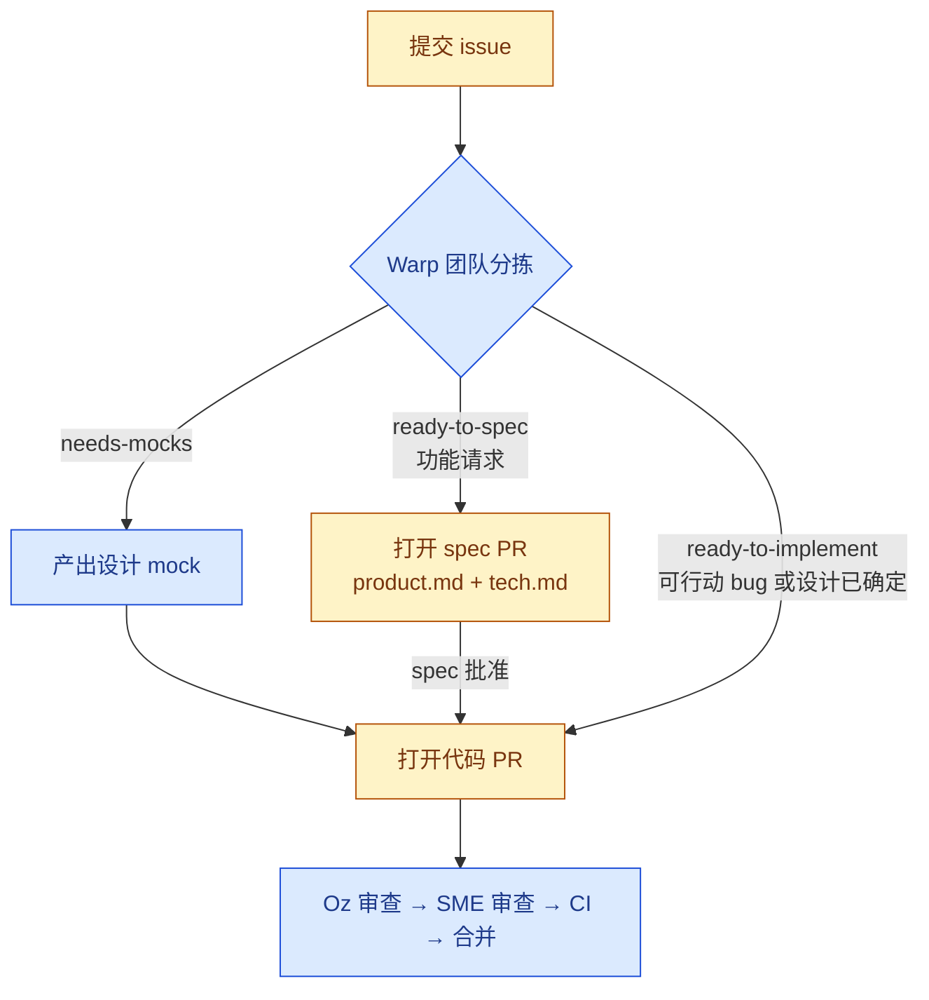

# 为 Warp 做贡献

感谢你帮助改进 Warp。本指南说明如何提交 issue、提出变更并让你的工作进入审查。

> [!TIP]
> **在 Slack 中和我们交流。** 你可以在 [`#oss-contributors`](https://warpcommunity.slack.com/archives/C0B0LM8N4DB) 频道与其他贡献者和 Warp 团队沟通。这里适合临时问题、设计讨论，以及在处理 issue 或 PR 时与维护者结对协作。刚加入？请先加入 [Warp Slack 社区](https://go.warp.dev/join-preview)，再进入 `#oss-contributors`。

## TL;DR

- 只要报告中的细节或维护者分拣结果足以支撑行动，欢迎提交 bug 修复。
- 功能请求必须先标记为 `ready-to-spec` 或 `ready-to-implement`，PR 才会被接受。
- 标记为 `warp:reserved-internal` 的 issue 正由 Warp 团队处理，不开放贡献者 PR。
- 较大 issue 的技术和设计讨论应放在 spec 中完成。
- Oz 会自动分拣新 issue，并审查打开的 PR。
- 实现类 PR 必须包含手动测试证据。

## Warp 贡献流程如何运作

Warp 的贡献模型受 [Oz](https://oz.warp.dev) 影响。Oz 是一个自动化部分分拣、spec 编写、实现和审查工作的 agent。与典型开源仓库相比，这里有一些流程差异：

- **Issue 是一切工作的起点。** 讨论、范围界定和设计都应先在 issue 中完成，再打开任何 PR。
- **功能请求和 bug 修复不同：**
  - 功能由准备状态标签门控：先是 `ready-to-spec`，设计确定后才是 `ready-to-implement`。这些标签表示贡献者何时可以接手工作。仅有讨论并不代表已经批准开始实现。
  - 功能工作必须先有书面 spec：在写任何代码之前，功能请求会先经过一个 spec PR，其中包含提交到 [`specs/`](specs/) 下的 *product spec* 和 *tech spec*。
  - Bug 修复在报告可复现或足以行动后，可以直接进入代码 PR；除非范围或设计不清晰，否则不需要 spec PR。
- **审查很大程度上自动化。** 打开 PR 后，Oz 会自动被指派并给出初始审查。Oz 批准后，会自动请求 Warp 团队对应领域专家继续审查；你不需要手动指派人工 reviewer。

### 准备状态标签

当某个 issue 可以由贡献者接手时，Warp 团队会添加以下标签之一：

- **`ready-to-spec`** - 问题已经理解，但设计仍开放。请在 [`specs/`](specs/) 下打开包含 *product spec*（`product.md`）和 *tech spec*（`tech.md`）的 spec PR。每份文档应包含哪些内容，请看[打开 Spec PR](#打开-spec-pr)。此标签**仅用于功能请求**。
- **`ready-to-implement`** - issue 已准备好进入代码 PR。对 bug 来说，这表示报告已经足够可复现或可行动，且可能的修复不需要 spec、mock 或更深调查。
- **`needs-mocks`** - 开始实现前需要设计 mock。请等待 Warp 团队补齐。
- **`warp:reserved-internal`** - Warp 团队将该工作保留给内部实现或对齐。不要为带有此标签的 issue 打开 spec PR 或代码 PR；Oz 会拒绝关联这些 issue 的贡献者 PR，并附上说明评论。

任何人都可以接手 ready issue。准备状态标签不是任务指派，最佳实现会通过正常审查胜出。如果某个 issue 长时间未分拣，或你希望重新评估准备状态，请在评论中提及 **@oss-maintainers**，让团队关注。

## 贡献流程

你（贡献者）负责的步骤用黄色表示；Warp 团队或 Oz 负责的步骤用蓝色表示。



## 提交高质量 Issue

提交前请先搜索[现有 issue](https://github.com/warpdotdev/warp/issues)，避免重复。提交时请使用 issue 模板。

如果你已经在运行 Warp，最快的提交方式是使用 `/feedback` 命令。它会打开一个公开 GitHub issue，并自动附上相关上下文（日志、环境详情）。

### Bug 报告

一份好的 bug 报告应包含：

- 清晰标题和一段问题摘要。
- 复现步骤（尽可能包含最小示例）。
- 预期行为与实际行为。
- Warp 版本和操作系统（见 `Settings → About`）。
- 相关日志、截图或录屏。

当 issue 被分拣为可行动 bug 后（由 Oz 的分拣 agent 或维护者完成），它可能被标记为 **`ready-to-implement`**，此时你可以接手并打开代码 PR。

### 功能请求

一份好的功能请求应先描述面向用户的问题，再提出任何实现方案。请包含：

- 用户需求或痛点，以及受影响的人群。
- 当前行为及其不足。
- 期望行为或工作流草图（简短示例或 mock 会有帮助，但不是必需）。
- 任何相关约束（兼容性、相关功能、先例等）。

功能请求会走 spec 流程：当问题已被理解且设计对贡献者开放时，维护者会添加 **`ready-to-spec`**。之后的下一步是 spec PR，而不是代码 PR。

自动分拣可能添加信息性标签（`area:*`、`repro:*` 等）。这些标签不影响准备状态。

## 打开 Spec PR

标记为 `ready-to-spec` 的 issue 需要先有 spec，代码才能开始。一个 spec 由提交到 [`specs/GH<issue-number>/`](specs/) 下的两份短文档组成：

- **`product.md`**（*product spec*）- 从消费者视角（用户、API 调用方、CLI 用户等）定义期望行为，并避免实现细节。核心内容是一组编号的**可测试行为不变量**，覆盖成功路径、用户可见状态、输入和响应，以及边界情况（空状态 / 错误 / 加载、取消、离线、权限拒绝、竞态、可访问性）。可选章节包括：问题陈述、目标 / 非目标、Figma 链接、开放问题。
- **`tech.md`**（*tech spec*）- 基于本代码库的实现计划。必需章节包括：**Context**（当前系统和相关文件，并带行号引用）、**Proposed changes**（触及的模块、新类型 / API / 状态、数据流、取舍）以及 **Testing and validation**（如何验证 product spec 中每条不变量）。可选内容包括：端到端流程、Mermaid 图、风险、并行化、后续事项。

spec 编写 skill 来自 [`warpdotdev/common-skills`](https://github.com/warpdotdev/common-skills)，不是直接在本仓库编写。本 checkout 会在 [`skills-lock.json`](skills-lock.json) 中固定期望版本，bootstrap 脚本可为你恢复这些 skill：

- `./script/bootstrap` 默认安装或更新 common skills，并在需要时提示选择安装到项目本地或全局。
- `./script/bootstrap --install-common-skills-in-repo` 会把锁定的 common skills 安装到当前 checkout 的 `.agents/skills/`。
- `./script/bootstrap --install-common-skills-globally` 会把锁定的 common skills 安装到 `~/.agents/skills/`。
- `WARP_COMMON_SKILLS_INSTALL_TARGET=project ./script/bootstrap` 和 `WARP_COMMON_SKILLS_INSTALL_TARGET=global ./script/bootstrap` 可用非交互方式选择同样的目标。
- `./script/bootstrap --skip-common-skills` 会保持 common skills 不变，适用于你单独管理这些 skill 的情况。

打开 spec PR：

1. 添加 `specs/GH<issue-number>/product.md` 和 `specs/GH<issue-number>/tech.md`。结构良好的 spec 示例可参考 [`specs/GH408/`](specs/GH408/)、[`specs/GH1063/`](specs/GH1063/) 和 [`specs/GH1066/`](specs/GH1066/)，也可以浏览 [`specs/`](specs/) 下的其他文档。安装 common skills 后，可以使用 `/write-product-spec` 和 `/write-tech-spec` skill 脚手架生成这些文档。
2. 将该 PR 作为产品和技术讨论的主场。
3. spec 批准后，实现通常会在同一个 PR 上继续。少数情况下，例如大型 spec 单独合并以便拆分实现，后续可以转到关联的 follow-up PR。

## 打开代码 PR

对标记为 `ready-to-implement` 的 issue：

1. 从 `master` 创建分支。
2. 实现变更并添加测试（见[测试](#测试)）。
3. 运行 `./script/presubmit`，并在推送前修复所有失败。
4. 使用 [pull request 模板](.github/pull_request_template.md) 打开 PR，并添加 changelog 条目（`CHANGELOG-NEW-FEATURE`、`CHANGELOG-IMPROVEMENT` 或 `CHANGELOG-BUG-FIX`）；只有纯文档或纯重构变更可以省略。
5. 保持 PR 聚焦于单个逻辑变更，并在 PR 进入审查前合并 `master`。

你**不需要手动请求 reviewer**。面向 ready issue 的 PR 会自动指派 Oz，并由它给出初始审查。Oz 批准后，会自动请求合适的 Warp 团队领域专家进行后续审查。

推送处理 Oz 反馈的变更后，请在 PR 中评论 `/oz-review` 请求重新审查。每个 PR 最多可以这样做**三次**。如果流程卡住，或你需要超过三次审查，请在 PR 中提及 **@oss-maintainers** 升级给团队处理。

**你必须包含[手动测试](#手动测试)证据**。对小型、独立、视觉相关变更，应包含**前后截图**。对较大、影响面广或交互式变更，还应包含**带解说的屏幕录制**。

如果维护者要求修改 PR，你需要再次请求 `/oz-review` 并通过它，之后才能请求复审。只要你通过 Oz 审查，它会自动为你请求复审。

### 没有关联 issue 的 PR

我们要求 PR 必须关联对应 issue。问题范围界定、[准备状态标签](#准备状态标签)添加，以及部分功能的 [spec 阶段](#打开-spec-pr)，都发生在 issue 中。完整流程请看[贡献流程](#贡献流程)。

也就是说，如果你在标准 issue 流程之前打开 PR，我们建议如下：

首先，**搜索相关 issue**。由于收到的 issue 数量较多，某个功能或 bug 修复通常已经有对应 issue。如果找到，请在 PR 描述中链接它。理想情况下，该 issue 已由维护者审查并带有[准备状态标签](#准备状态标签)。如果找不到相关 issue，请提交一个 issue 描述你的 PR 解决了什么。维护者审查该 issue 和关联 PR 后，可以添加准备状态标签以解除最终检查阻塞。

然后，**确保你的 PR 通过代码审查，并按[打开代码 PR 指南](#打开代码-pr)包含相关测试**。如果代码审查通过且测试相关性充分，这会给我们更早审查你的工作提供强信号。

## 使用编码 Agent

你可以使用**任何编码 agent** 来实现贡献，例如 Warp 内置 agent、Claude Code、Codex、Gemini CLI 或其他工具，也可以完全不用 agent。本仓库提供了 agent 可读上下文，包括 [`.agents/skills/`](.agents/skills/) 下的 skill、[`specs/`](specs/) 下的 spec，以及 [`WARP.md`](WARP.md)。任何支持这些格式的 harness 都可以读取它们。

如果你更希望由 **Oz cloud agent** 帮你实现 ready issue，请在 issue 中提及 **@oss-maintainers** 并提出请求。获批请求会使用赠送的 Oz credits **免费**运行，你不需要设置自己的 Oz 账户，也不需要支付计算费用。

虽然你可以使用编码 agent 完成实现，我们仍希望贡献者**亲自与我们协作**。这意味着你不应使用 OpenClaw 这类 agent 代替你与团队对话。我们的维护者始终会把你当作真人沟通，所以也请你以真人身份与我们沟通。

## 代码审查

所有 pull request 都会经过两阶段审查流程：

1. **Oz 审查** - 当你打开 PR 时，[Oz](https://warp.dev/oz) 会自动被指派并产出第一轮审查。Oz 会检查正确性、风格、测试覆盖，以及是否与关联 issue 和相关 spec 对齐。
2. **Warp 团队审查** - 只有在 Oz **批准**后，PR 才会路由给 Warp 团队领域专家进行最终人工审查。尚未被 Oz 批准的 PR 不会指派给团队成员。

任何阶段你都不需要手动请求 reviewer。推送处理 Oz 反馈的变更后，请在 PR 中评论 `/oz-review` 请求重新审查。每个 PR 最多可以这样做**三次**。如果流程卡住或你需要额外审查，请在 PR 中提及 **@oss-maintainers** 升级给团队处理。

### 已请求修改的陈旧 PR

如果 Oz 或维护者的审查让你的 PR 处于 **changes requested** 状态，随后又长期没有动静，自动化流程会跟进并最终关闭它，以保持审查队列有效。此规则仅适用于有活跃 requested-changes 审查的外部贡献者 PR。

- 如果 PR 无活动，会在 **7** 天和 **14** 天发布提醒，并在 **26** 天发布**最终警告**。
- PR 会在无活动约 **30** 天后**自动关闭**，但只有在最终警告之后才会关闭，所以你会先收到提醒。
- 只有**你的**活动会重置计时器：推送到你的分支（包括 force-push）或在 PR 中评论。维护者评论不会重置计时器，因为此时 PR 正在等待你处理。
- 要保持 PR 打开，只需推送更新或回复。关闭的 PR 可以在你准备继续时重新打开（重新打开并推送，或请求维护者重新打开）。
- 维护者可以添加 **`no-autoclose`** 标签来豁免应保持打开的 PR，例如该 PR 被我们阻塞时。

## 开发环境准备

完整工程指南见 [README.md](README.md) 和 [WARP.md](WARP.md)。快速开始：

```bash
./script/bootstrap   # 平台相关环境准备
cargo run            # 构建并运行 Warp
./script/presubmit   # fmt、clippy 和测试
```

## 测试

大多数代码变更都需要测试：

### 手动测试

凡是可以手动测试的变更，都必须手动测试；几乎所有变更都可以手动测试。对小型、独立、视觉相关变更，应包含**前后截图**。对较大、影响面广或交互式变更，还应包含**带解说的屏幕录制**。

你可以使用 `./script/run` 在本地运行应用。环境准备详情见 [WARP.md](WARP.md)。

### 自动化测试

- **Bug 修复**应包含能捕获该 bug 的回归测试。
- **算法或非平凡逻辑**需要单元测试。
- **面向用户的流程**只要行为可以这样覆盖，就应在 [`crates/integration/`](crates/integration/) 下提供端到端覆盖。交付变更的测试覆盖质量要求很高；在 agent 驱动开发下，预期是更多集成测试，而不是只覆盖 P0 路径。如果某个流程值得发布，通常也值得写集成测试。

使用 `cargo nextest run` 运行单元测试。

## 代码风格

- `./script/format --check` 和 `cargo clippy --workspace --all-targets --all-features --tests -- -D warnings` 必须通过。
- 优先使用 import 而不是路径限定符，优先使用内联格式参数（`println!("{x}")`），并优先使用穷尽 `match` 而不是 `_` 通配符。
- 完整风格指南见 [WARP.md](WARP.md)，其中包括 WarpUI 模式和 terminal model 加锁规则。

## Commit 和分支约定

- 分支名应以你的 handle 为前缀（例如 `alice/fix-parser`）。
- commit message 应说明 *what* 和 *why*，而不只是 *what*。

## 行为准则

本项目采用 [Contributor Covenant](https://www.contributor-covenant.org/)（v2.1）作为行为准则。所有贡献者和维护者都应在每个项目空间中遵守它。完整文本见 [`CODE_OF_CONDUCT.md`](CODE_OF_CONDUCT.md)，如需报告违规行为，请发送邮件至 warp-coc at warp.dev。

## 报告安全问题

我们的安全披露政策和私下报告渠道见 [`SECURITY.md`](SECURITY.md)。**不要为安全漏洞打开公开 issue。**

## 获取帮助

- 在 [Warp Slack 社区](https://go.warp.dev/join-preview)的 [`#oss-contributors`](https://warpcommunity.slack.com/archives/C0B0LM8N4DB) 频道中，与其他贡献者和 Warp 团队交流（新用户请先加入 workspace）。
- 浏览 [Warp 文档](https://docs.warp.dev/)。
- 为 bug 或功能请求打开 [GitHub issue](https://github.com/warpdotdev/warp/issues)。
